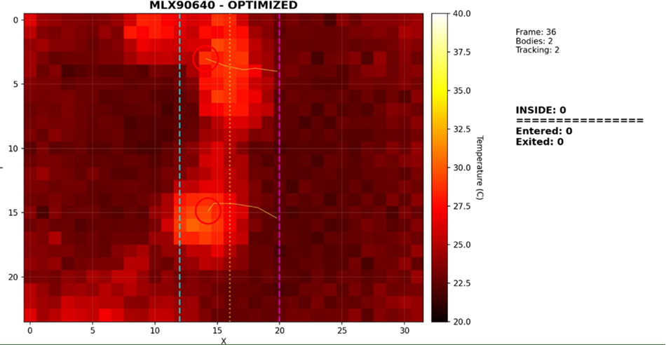

# ThermalFlow

Anonymous people-flow counting with a 32x24 thermal sensor.

Built around the MLX90640 and an ESP32. The sensor reads heat signatures, not faces, so you get real counting without any camera or privacy issues. Firmware handles all the blob detection and tracking on-device, and can either stream raw frames to a Python dashboard or report entry/exit counts directly over serial.

## Preview



## What's in here

Open `index.html` locally, or publish this repository with GitHub Pages from the
root directory. No build step is required.

```
firmware/edge_counter/       ESP32 firmware: thresholding, blob detection, tracking, counting on-device
firmware/serial_stream/      streams raw 32x24 frames over serial at 460800 baud
firmware/wifi_stream/        same thing, but over TCP through the ESP32's own AP
software/thermal_dashboard/  Python side: frame parsing, heatmap render, tracking overlays, counters
```

## Hardware

- ESP32 dev board
- MLX90640 (32x24 IR array)
- I2C between them
- USB serial or WiFi for the host

## Running it

Install deps first:

```bash
pip install -r requirements.txt
```

Serial dashboard (flash `serial_stream.ino` or `edge_counter.ino` first, update `SERIAL_PORT` in the script):

```bash
python software/thermal_dashboard/thermal_dashboard_fast.py
```

WiFi dashboard (flash `wifi_stream.ino`, connect to `MLX90640_AP`):

```bash
python software/thermal_dashboard/thermal_dashboard_wifi.py
```

There's also `thermal_counter_cli.py` if you just want the terminal counter with no GUI.

## Arduino

Open the sketch you need in Arduino IDE. The Adafruit MLX90640 library has to be installed before compiling.

- `firmware/edge_counter/edge_counter.ino` - on-device counting, outputs centers and counts over serial
- `firmware/serial_stream/serial_stream.ino` - raw frame dump for the Python dashboards
- `firmware/wifi_stream/wifi_stream.ino` - same but streams to a TCP client over WiFi
